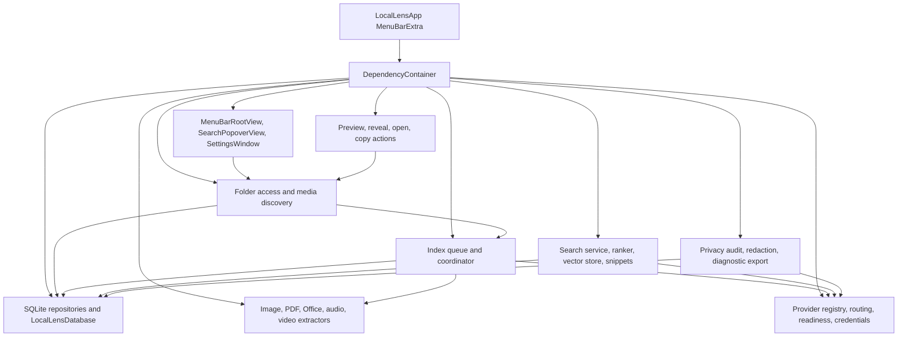
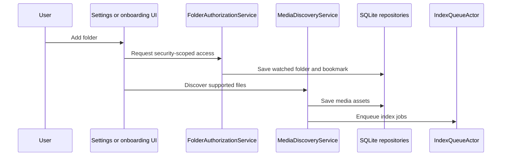
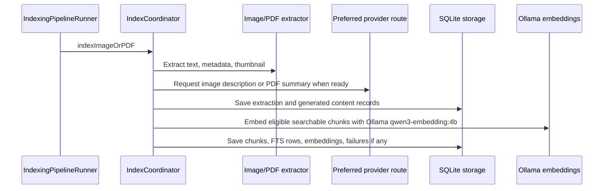
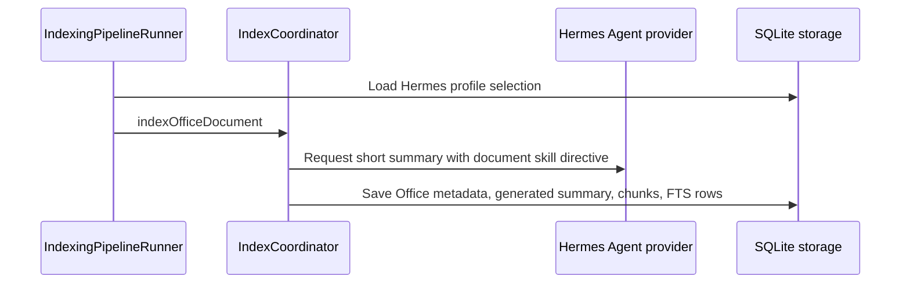
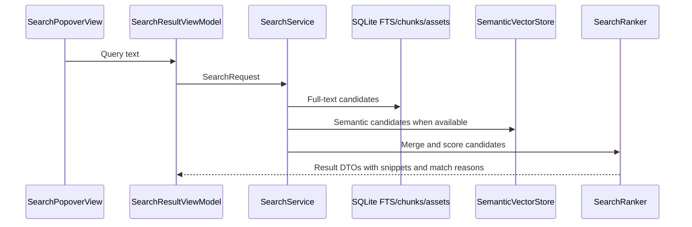

# Architecture

## System Overview

LocalLens is a native macOS menu bar application for building a private, searchable media library from user-selected folders. It indexes screenshots, images, PDFs, Office files, audio, and video into local SQLite storage, then lets the user search from the menu bar by filename, extracted text, generated descriptions or summaries, transcripts, labels, and semantic meaning.

The architecture is a single-process SwiftUI/AppKit desktop app. `LocalLensApp` creates a `MenuBarExtra`, injects a `DependencyContainer`, and exposes app commands. `DependencyContainer` composes the storage repositories, extraction services, indexing actors, provider routing services, search services, folder access services, result actions, diagnostics, and settings UI.

The design is local-first and non-destructive. Source files are read from user-authorized folders through app-scope bookmarks and are never modified. Derived data, thumbnails, generated content, queue state, provider settings, failures, and diagnostics are written only to LocalLens-controlled local storage.

## Component Diagram



The app shell drives user interaction. Folder authorization and discovery produce media assets and index jobs. The indexing pipeline drains jobs in the background, uses extractors and provider routing where allowed, persists extraction records and searchable chunks, and updates queue progress. Search reads the local index and returns ranked result DTOs with snippets and match reasons. Diagnostics summarize provider and failure state through redaction policies.

## Technology Stack

| Category | Technology | Purpose |
|----------|------------|---------|
| Language | Swift 6 | Application, services, models, tests |
| UI | SwiftUI | Menu bar extra, settings, popover, views |
| Platform integration | AppKit, QuickLookUI | macOS windows, preview, Finder-style actions |
| Media extraction | Vision, PDFKit, AVFoundation, UniformTypeIdentifiers | OCR-like recognition, PDF handling, audio/video metadata, file type detection |
| Storage | SQLite3, FTS5, WAL | Local index, settings, queue, generated content, full-text search |
| Security | App sandbox, app-scope bookmarks, Security.framework, Keychain | Read-only folder access and provider credential storage |
| AI provider protocol | OpenAI-compatible HTTP endpoints | Models, embeddings, chat-style provider calls, Hermes profile discovery |
| Build | Xcode project plus `project.yml` | macOS app, unit tests, UI tests, coverage-enabled scheme |
| Tests | XCTest and XCUITest | Unit, integration, privacy, indexing, search, provider, and UI coverage |

## Design Decisions

### Decision 1: Native menu bar app

- **Decision**: LocalLens runs primarily as a `MenuBarExtra` with no required Dock window for normal search.
- **Rationale**: Search should be immediately available while the user works in other apps.
- **Alternatives considered**: A standard document-style app or web application.
- **Consequences**: App state and long-running work must remain responsive in background services and actors.

### Decision 2: Local SQLite index with FTS5 and embeddings

- **Decision**: Store watched folders, assets, extraction records, chunks, FTS entries, vectors, jobs, settings, generated content, and failures in app-controlled SQLite storage.
- **Rationale**: The index is local, rebuildable, queryable, and private by default.
- **Alternatives considered**: Cloud indexing, file-side metadata, or source-file mutation.
- **Consequences**: Schema migrations and repair/rebuild flows are required, but source files remain untouched.

### Decision 3: Dependency container composition

- **Decision**: `DependencyContainer` centralizes service construction and injects shared services into UI and workflows.
- **Rationale**: The app is a single-process desktop application with many cooperating services and testable dependencies.
- **Alternatives considered**: Global singletons or ad hoc service construction in views.
- **Consequences**: Startup construction is explicit, and tests can target individual services directly.

### Decision 4: Provider readiness replaces enable toggles

- **Decision**: Provider rows are always visible as configuration targets, while readiness controls whether a provider-backed stage can run.
- **Rationale**: This avoids ambiguous enabled/disabled states and makes missing models, profiles, credentials, or transport blocks actionable.
- **Alternatives considered**: Hide unavailable providers or allow provider-level enable toggles.
- **Consequences**: Settings must show readiness, selected model/profile state, and safe errors clearly.

### Decision 5: Fixed embedding route

- **Decision**: Embeddings use Ollama with model `qwen3-embedding:4b`.
- **Rationale**: A stable embedding route improves search consistency and keeps embeddings local.
- **Alternatives considered**: Use the selected descriptive provider or provider-specific embedding choices.
- **Consequences**: Ollama embedding readiness is separate from the selected Ollama generation model.

### Decision 6: Non-destructive file handling

- **Decision**: All source media and Office files are read-only inputs; LocalLens writes only derived app data.
- **Rationale**: The app needs broad access to personal libraries and must preserve trust.
- **Alternatives considered**: Source-side tagging, conversion, cleanup, or organization.
- **Consequences**: Rebuild and cleanup operate on the LocalLens index, not the source files.

## Directory Structure

```text
LocalLens/
  LocalLens/                         # Main application source
    AppShell/                        # Menu bar UI, search popover, settings, commands
    DesignSystem/                    # Theme, accessibility, Liquid Glass components
    Diagnostics/                     # Privacy audit, redaction, diagnostic export, failures
    Extractors/                      # Image, PDF, Office, audio, video, thumbnails
    FolderAccess/                    # Bookmarks, authorization, watched folder view model
    Indexing/                        # Queue, runner, coordinator, chunks, cancellation, progress
    Inference/                       # Provider clients, routing, readiness, credentials, prompts
    MediaDiscovery/                  # Recursive discovery, file identity, media type resolver
    PreviewActions/                  # Preview, reveal, open, copy path/snippet actions
    Resources/                       # Info.plist, entitlements, assets
    Search/                          # Search service, ranker, vector store, snippets, view model
    Storage/                         # SQLite database, migrations, models, repositories, cache paths
    Support/                         # Build configuration and dependency container
  LocalLensTests/                    # Unit and integration tests by feature area
  LocalLensUITests/                  # UI automation tests for onboarding, search, settings
  specs/001-local-media-library/     # Initial private media library specification and contracts
  specs/002-office-provider-settings/# Office indexing and provider/profile specification
  specs/003-ai-provider-indexing/    # Preferred provider and generated content specification
  plan/                             # Product planning artifacts
  .sdd/docs/                         # Generated application documentation
  project.yml                        # XcodeGen-style project definition
  LocalLens.xcodeproj/               # Xcode project and shared scheme
```

## Data Flow

### Folder onboarding and discovery



The discovery service recursively enumerates regular files, skips hidden files, packages, symlinks, unsupported files, and disallowed Office kinds, then records supported assets and queue jobs.

### Image and PDF indexing



The preferred provider is used only for image descriptions and PDF summaries. Missing readiness blocks only the affected provider-backed stage and records safe failure information.

### Office indexing



Office files are routed only to Hermes Agent. A valid selected Hermes profile is required before Office indexing starts.

### Audio and video indexing

Audio and video indexing extracts local metadata, transcripts or scene information where available, and searchable chunks. `ProviderRoutingService` blocks audio and video AI-provider stages, so new audio or video indexing work does not prompt AI providers.

### Search



Search returns a bounded, ranked result list with thumbnails when available, file context, match reasons, snippets, and page or timestamp hints where available.

## Operational Qualities

- Background indexing uses actors and cancellation checks to keep the UI responsive.
- Progress snapshots publish queue state and safe labels.
- Safe failure categories and retryability are persisted for recovery.
- Diagnostics and redaction avoid credentials, raw prompts, full paths, full provider bodies, and full extracted/generated content by default.
- Tests cover storage migration, provider routing, privacy defaults, source mutation guards, media discovery, indexing, search, and UI accessibility identifiers.
